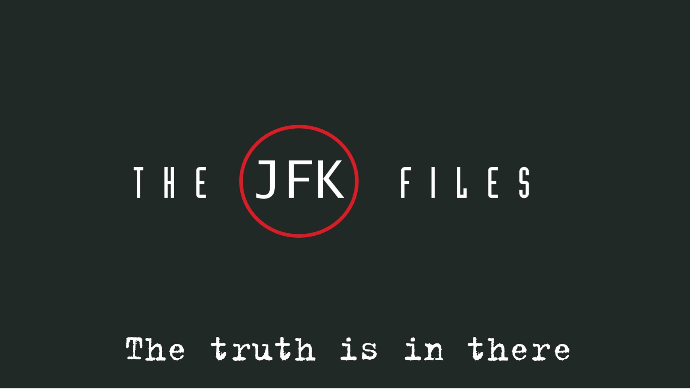
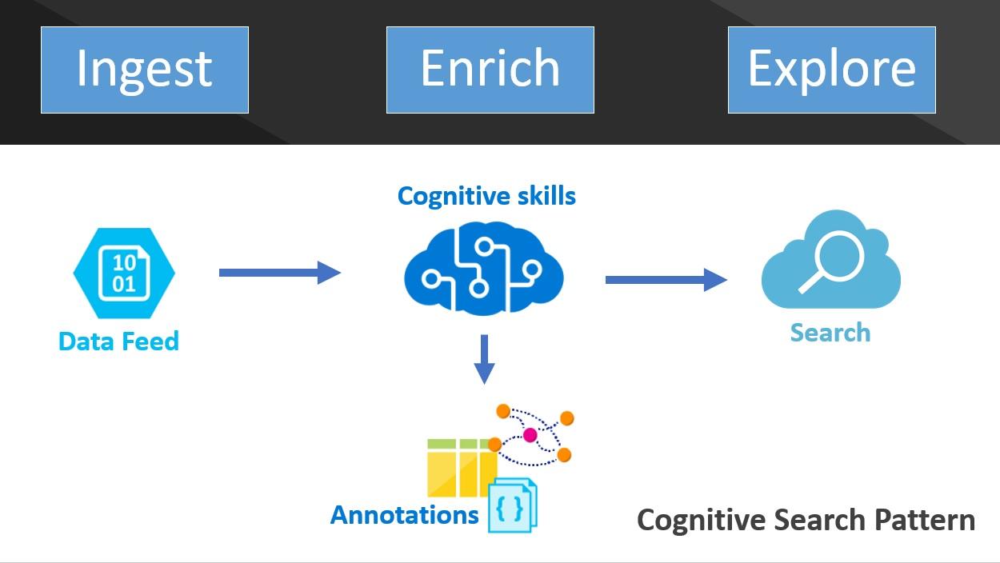
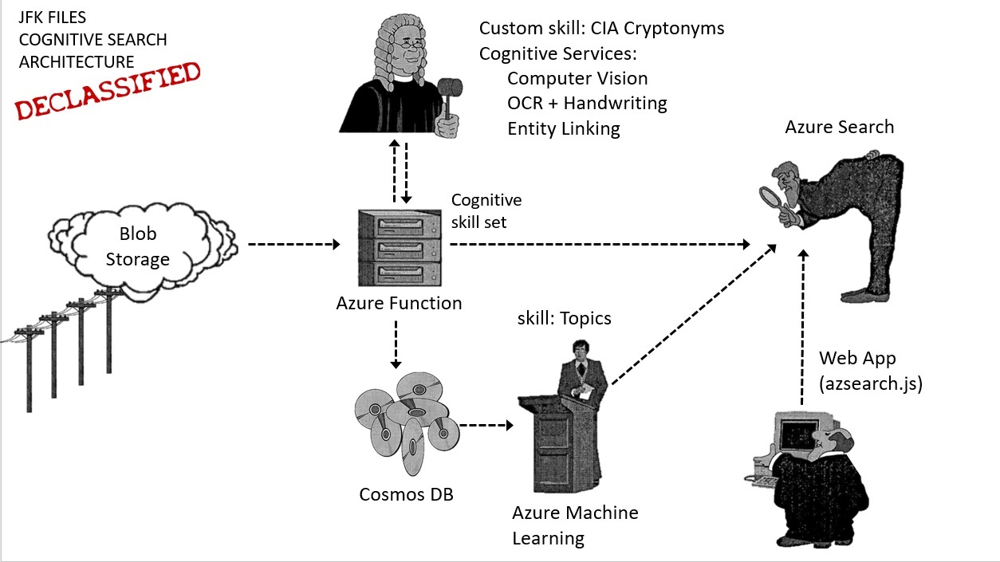

# The JFK Files
Explore the JFK Assassination files using Azure Search and Microsoft Cognitive Services.

You can watch the demo in action in [Joseph Sirosh Connect 2017 session (@8:10)](https://channel9.msdn.com/Events/Connect/2017/G102)
or explore the JFK files youself with our [Online Demo](https://aka.ms/jfkfiles-demo).

## Cognitive Search Pattern
This project demonstrates the Cognitive Search pattern in Azure using the JFK files.

This pattern feeds data into the cloud, applies a set of cognitive skills
 which extracts knowledge and stores it as annotations
 and creates new experiences exploring the data using Search.

## JFK Files Architecture
Note: This diagram of visuals are inspired by the [CIA's JFK document management system in 1997](https://www.archives.gov/files/research/jfk/releases/docid-32404466.pdf) included in the JFK files.

1. The [JFK PDF documents](https://www.archives.gov/research/jfk/2017-release) and images are uploaded to the cloud into Azure Blob Storage
2. An [Azure Function](https://azure.microsoft.com/en-us/services/functions/) triggered by the blog store and
    1. uses the [Cognitive Services Vision API](https://azure.microsoft.com/en-us/services/cognitive-services/computer-vision/) extract text information from the image via OCR, handwriting, and image captioning
    2. applies the [Entity Linking Intelligence Service](https://azure.microsoft.com/en-us/services/cognitive-services/entity-linking-intelligence-service/) to extract entities from the document linked to wikipedia topics
    3. Annotates text using a custom [CIA Cryptonyms](https://www.maryferrell.org/php/cryptdb.php) skill
    4. then adds the data to an [Azure Search](https://azure.microsoft.com/en-us/services/search/) index
    5. and saves the annotationed data to [Azure Cosmos DB](https://azure.microsoft.com/en-us/services/cosmos-db/)
6. Azure Machine learning reads all the data from Cosmos DB, ranks terms, extracts topics, and adds them to the index
5. A simple Web App uses the [AzSearch.js library](https://github.com/Yahnoosh/AzSearch.js) to search to index and explore the documents

## Limitations
1. This is a demo to showcase a congnitive search pattern.  It is not intended to be a framework or scalable architecture for all scenarios.
2. The code implementing storing the data in Cosmos DB and extracting topics in Azure ML is not yet included in this codebase.
   If you are interested in this contact (Azure Search on the MSDN forums)[https://social.msdn.microsoft.com/Forums/azure/en-US/home?forum=azuresearch].
3. The OCR technology is not perfect and the handwriting capability is in preview.  The results will vary greatly by scan and image quality.
4. The code currenly only processes images and will support most scanned PDFs. Native PDFs and some scanned PDF formats may not be parsed correctly.

## Setting up your own library

### Prerequisites
1. Azure Subscription you can access. All services can use the free teirs for this demo
2. [Visual Studio 2017](https://www.visualstudio.com/downloads/) with [Azure Developer Tools](https://azure.microsoft.com/en-us/tools/) enabled.
3. Basic familiarity with using the [Azure Portal](https://portal.azure.com) and cloning and compiling code from github

### Download the JFK Files
1. You should [download a few JFK files](https://www.archives.gov/research/jfk/2017-release) to experiment with, or [bulk download all of them](https://www.archives.gov/research/jfk/jfkbulkdownload).
   Alternativly, you can experiment with your own scanned PDF or image documents as well.

### Create Azure Services
> TIP: create all your Azure services in the same Resource Group and Region for best performance and managability

2. [Create Azure Search service](https://docs.microsoft.com/en-us/azure/search/search-create-service-portal) for your library.
   The free teir works well. Copy these settings that you will use later.
   1.  __Service Name__ (under the "Properties" section)
   2.  __Admin key__ (PRIMARY ADMIN KEY under "Keys" section)

3. [Create Azure Blob Storage account](https://docs.microsoft.com/en-us/azure/storage/storage-create-storage-account#create-a-storage-account) for your documents.
   The default values work well. Copy these settings that you will use later.
   1.  __Account Name__ (Storage account name under the "Access Keys" section)
   2.  __Account Key__ (key1 under the "Access Keys" section)

4. Get a 30 day Cognitive Services Trial Key for the [Computer Vision API](https://azure.microsoft.com/en-us/try/cognitive-services/?api=computer-vision) and [Entity Linking Intelligent Service API](https://azure.microsoft.com/en-us/try/cognitive-services/?api=entity-linking)  or [purchase one in the Azure Portal](https://docs.microsoft.com/en-us/azure/cognitive-services/cognitive-services-apis-create-account).
   Copy these settings that you will use later.
   1.  __API Key__ (key1 on the "your APIs" page)

### Update Code

5. Git clone or download this codebase and open the jfk-files.sln in Visual Studio.  The free community edition will work fine.
   Update the configuation settings constants in the *EnricherFunction\Config.cs* file where indicated with comments near the top of the file.  
   Set DataEnricher is as the default project and hit F5 to run it.  It should run without errors and create the search indexes, blob containers,
   and test your settings.  If it fails check your settings to ensure they are correct.
   

6. You can test the UI by running the DataEnricher project with a command line argument that points to a folder that contains some images to upload.
   >*DataEnricher.exe c:\myimages*
   
   To run the UI set the EnrichFunction as the startup project and press F5.
   In the UI Hit enter in the search box to see all content uploaded to the library.

### Setup an Automated Pipline

7. [Create Azure Function App](https://docs.microsoft.com/en-us/azure/azure-functions/functions-create-first-azure-function#create-a-function-app) for your enricher.
   Choose a consumption plan to pay only for what you use, or create a free App Service plan that you will share with your web UI.
   Right click the EnricherFunction Project in Visual Studio and select *Publish...* then publish to the Function app you created.
   Now go to the function app in the Azure Portal and expand *Functions* and then *EnrichImages* and click *Integrate*.
   Associate the storage account with this function by clicking *new* next to the *Storage account connection*
   and select the storage account you created earlier.  Click Save.
   > You can test the function by using the [Azure Storage explorer](http://storageexplorer.com/) to upload images to the *library* blob container on your storage account.

8. Upload your documents to the *jfk* container in your blob storage account or use [Azure Logic Apps](https://azure.microsoft.com/en-us/services/logic-apps/) to trigger the function.

### Publish your Web Application

9. In Visual Studio right click the SearchUI project and select publish.  You can create a new Azure Web App from Visual
   studio or you can do it in the Azure portal.  This application will work well on a free app service plan,
   or you can use the same app service plan as your function app if you created one earlier.

10. You can easily customize the UI by modifying the index.html to meet your needs.  The UI is generated using the
    [AzSearch.js](https://github.com/Yahnoosh/AzSearch.js) library and it takes [very little code](https://github.com/Yahnoosh/AzSearch.js#basic-usage)
    to change what is shown in the search interface.